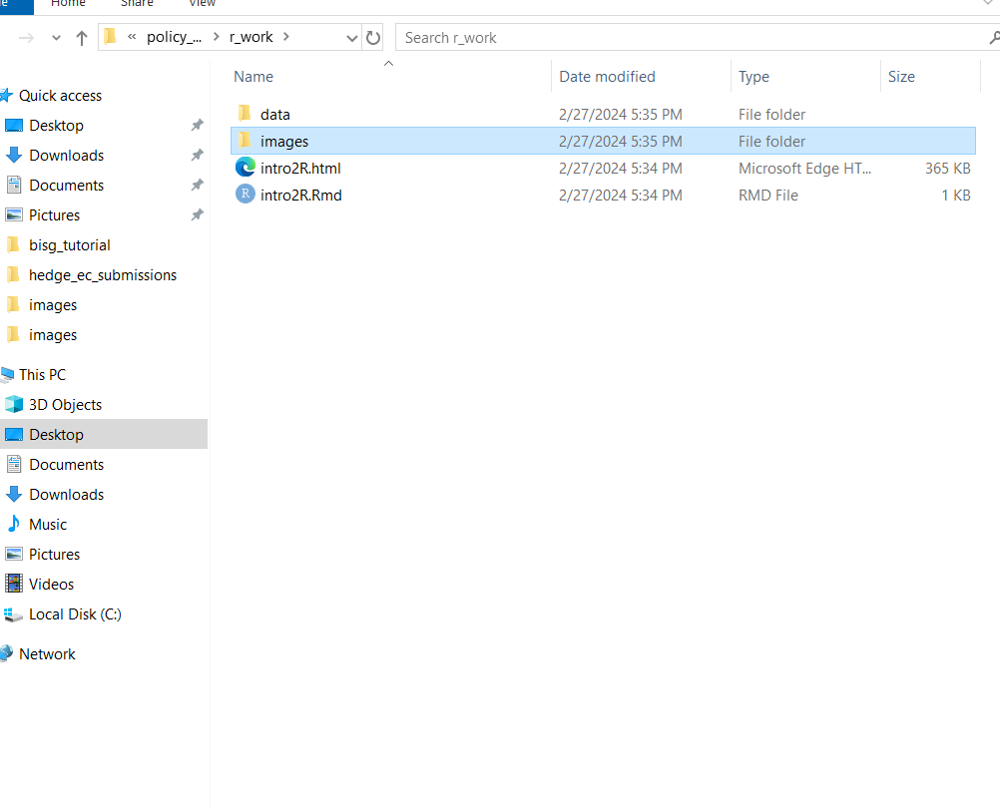

```{r setup, include=FALSE}
knitr::opts_chunk$set(echo = FALSE)
```

# Goals for today

- Learn basic operating features of R & R markdown 

- Types of data types and frames 

- Basic object oriented programming 

- Application to mapping police violence 

## Key things about R 

- Can read & process most data types 
   - .txt, .csv, .xlsx files, etc.
   
- A VERY large calculator 

- Object based oriented 

- naming is VERY important 

  -   Case sensitive 

```{r cars, echo = TRUE}
g = 6 * 6 + 8 
g 
```

## On sequences

- R all about SEQUENCE of code 

  - Must be run in order
  
  - Failure = "object does no exist" error 
  
- Various special commands to do more than math; 

  - Usually where things break down 
  
  - i.e., wrong package
  
- create objects with = or <-  

```{r logic, echo=TRUE}
try(y+8)

```

## Correct sequence: Rise over run  

```{r test_sequence, echo=TRUE}

m = 0.25 
x = seq(-10,10,by=1) ## note, this is one of those special commands 
b = -5 # IF you couldn't guess, the hashtag comments out code 
y = m*x + b 
plot(x,y) ## here is another, a function that takes x then y 
``` 

## Implications? 

- Most common errors b/c lines not run in correct sequence 

   - i.e., highlight all code, then click "run" button 
   
- "Dependencies" critical to understanding programming 

- Don't despair at errors; 

  - Deep breath, then debug 
  
  - Google is your friend 
  
    - Google the message in the error 
  
  - note: Never spend more than 30 minutes alone debugging by self
  
## On functions 

- Some cool things not in base R 

- Can create "functions" to do cool things given inputs 

  - i.e, the same math applied over and over again 

- Functions are likewise objects 

- Use the core "function" followed by parameters in parentheses 

```{r function example, echo=TRUE}

cool_fxn <- function(x,slope,intercept){
  y = x*slope + intercept
  return(y)
}

cool_fxn(x=seq(0,10,by=1), slope=0.4,intercept=2)

```


## Libraries 

- Some functions grouped together in "packages" 

  - Can be downloaded for free 
  
    - cough, Hobbes is wrong, cough
    
- Just use the "library" command 

  - Will have access to a bunch of new functions 
  
- Want them at start of script 
  
```{r library install, warning=FALSE, echo=TRUE}
library(stringr) # use command "library" to load in a set of functions 
x = "Hedgehogs are cool"
y = str_replace(x, "are", "R") # this fxn from the stringr package
y

```

## Reading in data 

- R is awesome because it processes data 

  - Stuff in excel files, for example 
  
- Folder directory structure EXTREMELY important 

- File path how R identifies files 

```{r folder structure, echo=TRUE}
list.files("images",full.names = TRUE) # list files gets you all of 
# the files in a folder, which is in quotes 
```

## Example folder structure 
```{r picture of install chunk, out.width = "65%", echo=FALSE, fig.align='center',echo=TRUE}
 # note: R is able to read this 
# b/c the Rmd file is saved immediately above the "images" folder 

```


## Class types 

- Basic class types: vector, matrix, data frame, list 

  - Vector: sequence of things 
  
  - matrix: bunch of vectors in rectangular format 
  
  - data frame: a matrix with labels, i.e., column names 
  
  - list: whatever you want to shove into it 
  
```{r object illustration, echo=TRUE}
rrr = seq(1,100,by=5)
is.vector(rrr)

```

## Example of matrix 

```{r matrix, echo=TRUE}
N = 100
M = 20
set.seed(1337) ## making replicable 
test_matrix <- matrix( rnorm(N*M,mean=0,sd=1), N, M)  ### new command!!! 
class(test_matrix)
is.matrix(test_matrix)
test_matrix

```

## Example of list 

```{r list example, echo=TRUE}
messy_list = list(rrr,test_matrix) # since we ran these before, 
# these are real objects that can be shoved into a list 
messy_list[[1]]
messy_list[[2]]

```

## Reading in files & data frames 

- Need to know file type

- Goal: read in "data frames" 

  - Matrix like objects 
  
- Need 'foreign", "haven", and "readxl" libraries 

```{r dataframe readin,echo=TRUE}
## reading in from data folder 
mpv_df = read.csv("data/mpv_df02232024.csv") # note, 
# .csv are essentially format restricted excel files 
class(mpv_df)
names(mpv_df) # "names" get the name of every column

``` 

## Using data frames 

- Always want to inspect 

  - Size, types, missingness, etc. 
  
- What you'll use for most data analysis 

- Figure out descriptive stats first 

- Create plan on how to visualize; forecast 

```{r inspecting df, echo=TRUE}
dim(mpv_df) # gets rows by columns 
str(mpv_df[,1]) # brackets get the row by cols; find data types 
# summary(mpv_df[,2])

```

## Getting summary stats 

- Use the "summary" fxn 

  - Gets min, max, ave, med, etc. 
  
- Look at "quantiles" as you set them 

  - Always a fun first cut 
  
- Use the "$" to pull a column from df to treat as vector 

```{r analyze_col1, echo=TRUE}
summary(mpv_df$pop_total_census_tract) # the go to fxn for summaries 
quantile(mpv_df$pop_total_census_tract,seq(0,1,by=0.1),na.rm=T) # use sequence to dist
# na.rm=T removes missing data that would otherwise break 

```

## Creating simplified tables 

- Want to simplify data read in 

  - Descriptive purpose 
  
- Best to use "tidyverse" pkg 

  - Piping to do sequential commands 
  
```{r piping, echo=TRUE, warning=FALSE,message=FALSE}
library(tidyverse) # for piping and such
library(knitr) # gets cool tables in R markdown 
simp_tbl <- mpv_df %>% ## calls df 
  group_by(race) %>% ## this pipes and groups by
  tally() # gets a tally of above 

```

## Results 
```{r results race, echo=TRUE,message=FALSE}
kable(simp_tbl) # command from knitr; full tbl not visible
```